MPRNA-IP source code and manuscript figures
================
Taeyoung Hwang, Jan 5, 2023

``` r
library(cowplot)
library(ggrepel)
library(ggpubr)
library(GGally)
library(gridExtra)

library(dplyr)
library(reshape2)

library(edgeR)
library(MASS)

library(GenomicRanges)
```

``` r
theme_set(theme_cowplot())
source("github_functions.R")
```

# 1. Optimization of MPRNA-IP (using hTR pool)

### Barcode number

Load raw count data.

``` r
load("RawData/final_hTR_pipeline.Rdata")
```

Randomly select barcodes for different numbers of barcodes.  
Calculate correlation coefficients of log2FC between two samples.

``` r
# Using the counts of replicate 2 and replicate 3
barcode.sim.corr <- simCorrLog2FC(c("Rep2", "Rep3"), 1:23, 10)
temp <- melt(barcode.sim.corr, varnames=c("barcodeNum", "simulation"), value.name="corr")
temp$barcodeNum <- factor(temp$barcodeNum, levels=1:23)

p <- ggplot(temp, aes(x=barcodeNum, y=corr))
p <- p + geom_boxplot()
p <- p + scale_y_continuous(breaks=seq(0,1,0.1))
p <- p + background_grid()
p
```

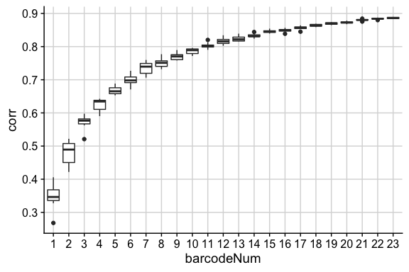<!-- -->

### Sequencing depth

Load raw count data.

``` r
load("RawData/final_Assay_subsample.Rdata")
```

Select random oligos.

``` r
temp <- subset(tile.table, type=="Random")$tileID
count.table.random <- subset(count.table, tileID %in% temp)
```

Calculate RPM by using total depth with the sum of depth across random
oligos.

``` r
temp <- dcast(count.table.random, sample~., value.var = "raw", fun.aggregate = sum)
count.table.random$depth <- temp[match(count.table.random$sample, temp$sample), 2]
count.table.random$rpm <- count.table.random$raw/(count.table.random$depth/10^6)
```

Count the number of missing oligos at every sequencing depths.

``` r
# Using the replicate 1 (Input) experiment
temp <- mOligoCount(count.table.random, "rep1in", c(0,1,2))
temp <- melt(temp, id.vars = "sample", variable.name = "threshold", value.name="count")
temp$replicate <- count.table.random$replicate[match(temp$sample, count.table.random$sample)]
temp$sampling <- count.table.random$sampling[match(temp$sample, count.table.random$sample)]
temp$simID <- count.table.random$simID[match(temp$sample, count.table.random$sample)]
temp$depth <- count.table.random$depth[match(temp$sample, count.table.random$sample)]
tileNum <- length(subset(tile.table, type=="Random")$tileID)
temp$avgDepth <- temp$depth/(tileNum*BARCODE_NUM)
temp$countRate <- temp$count/(tileNum*BARCODE_NUM) # Proportion relative to 100*25 random oligos

p <- ggplot(temp, aes(x=avgDepth, y=countRate, col=threshold, shape=threshold))
p <- p + geom_point(size=2) + geom_smooth()
p <- p + xlab("Average depth") + ylab("Proportion of missing oligos")
p <- p + scale_x_continuous(breaks=seq(200,800,by=100))
p <- p + scale_color_manual(values=c("black", "blue", "red"))
p <- p + background_grid() # always place this after the theme
p <- p + theme(axis.text.x=element_text(angle=70, hjust=1, vjust=1))
p <- p + background_grid()
p
```

    ## `geom_smooth()` using method = 'loess' and formula = 'y ~ x'

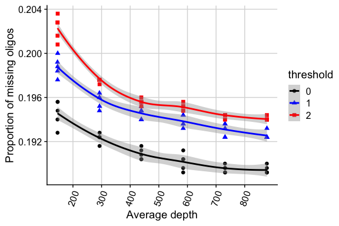<!-- -->

# 2. PUM2 MPRNA-IP

### Load raw count data and tile annotations.

``` r
load("RawData/git_PUM2_pipeline.Rdata") # raw data
BARCODE_NUM <- 22
REPLICATE_NUM <- 3
```

### Filtering and pooling

``` r
pooled.count <- oligoFilter(oligo.count, inputFilterBy="rpm", inputTh=1, ipFilterBy="rpm", ipTh=1) %>% countPooler()
```

    ## Proportion of oligos after filtering:  0.2632043 
    ## Proportion of tiles after filtering and pooling:  0.7023139

``` r
pooled.fastqc <- fastqc[match(colnames(pooled.count), fastqc$SampleID),]
pooled.fastqc <- droplevels(pooled.fastqc) 
```

### Enrichment

Limma + Voom

``` r
pooled.model <- model.matrix(data= pooled.fastqc, ~ 0 + Pulldown + Repl)
edgeR.obj <- DGEList(pooled.count)
edgeR.obj <- calcNormFactors(edgeR.obj, method="TMM")
y <- voom(edgeR.obj, pooled.model, plot = T)
```

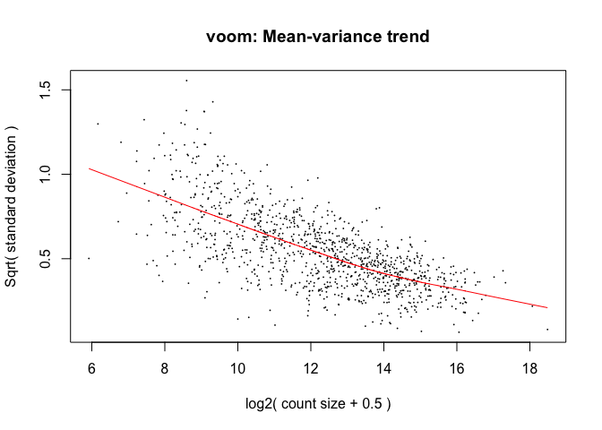<!-- -->

``` r
fit <- lmFit(y, pooled.model)
contr <- makeContrasts(PulldownIP - PulldownInput, levels = colnames(coef(fit)))
out <- contrasts.fit(fit, contr)
out <- eBayes(out)
out.table <- topTable(out, sort.by = "P", n = Inf)
hist(out.table$P.Value)
```

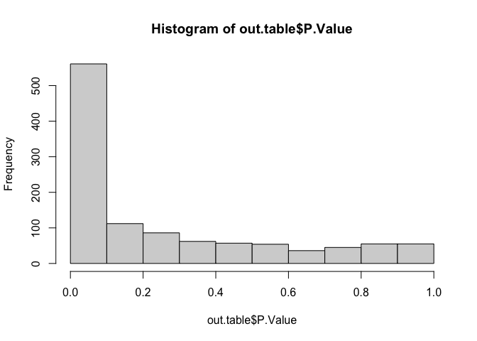<!-- -->

``` r
table(out.table$adj.P.Val<0.01, out.table$logFC>0)
```

    ##        
    ##         FALSE TRUE
    ##   FALSE   496  395
    ##   TRUE     74  158

Significant tiles

``` r
tile.table <- data.frame(tileID=tile.annot$tileID, stringsAsFactors = F)
idx <- match(tile.table$tileID, rownames(out.table))
tile.table$rpm <- 2^out.table$AveExpr[idx]
tile.table$log2FC <- out.table$logFC[idx]
tile.table$stat <- out.table$t[idx]
tile.table$pval <- out.table$P.Value[idx]
tile.table$padj <- out.table$adj.P.Val[idx]
tile.table$sig <- factor(tile.table$padj<0.01, levels=c("TRUE", "FALSE"), labels=c("Sig", "Insig"))

tile.table$enriched <- NA
tile.table$enriched[!is.na(tile.table$stat)] <- "Insig"
tile.table$enriched[which(tile.table$sig=="Sig" & tile.table$log2FC>0)] <- "Enriched"
tile.table$enriched[which(tile.table$sig=="Sig" & tile.table$log2FC<0)] <- "Depleted"
table(tile.table$enriched)
```

    ## 
    ## Depleted Enriched    Insig 
    ##       74      158      891

MA plot

``` r
p <- ggplot(subset(tile.table, !is.na(log2FC)), aes(x=log10(rpm), y=log2FC))
p <- p + geom_point(data=subset(tile.table, enriched=="Insig"), col="gray", alpha=0.5)
p <- p + geom_point(data=subset(tile.table, enriched=="Depleted"), col="blue", alpha=0.8)
p <- p + geom_point(data=subset(tile.table, enriched=="Enriched"), col="red", alpha=0.8)
p <- p + geom_hline(yintercept = 0, linetype="dashed")
p <- p + xlab("Log10 (Mean RPM)") + ylab("Log2 (IP/Input)")
p
```

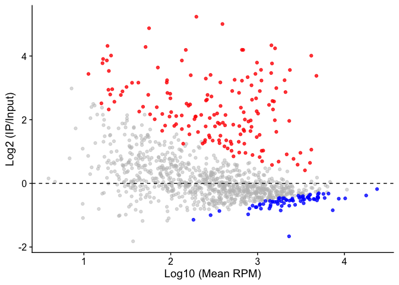<!-- -->

### Analysis

PRE effect on fold change

``` r
temp <- subset(tile.table, !is.na(log2FC))
temp$pre.num <- tile.annot$pre.num[match(temp$tileID, tile.annot$tileID)]
table(temp$pre.num)
```

    ## 
    ##    0    1    2 
    ## 1043   71    9

``` r
p <- ggviolin(temp, x="pre.num", y="log2FC", color="pre.num", palette=c("black", "blue", "red"), alpha=1, add="jitter", add.params=list(size=1, alpha=0.7))
p <- p + stat_compare_means(comparisons = list( c("0", "1"), c("1", "2") ), size=5)
```

    ## [1] FALSE

``` r
p <- p + geom_hline(yintercept = 0, linetype="dashed")
p
```

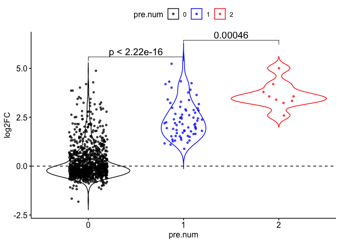<!-- -->

GC %

``` r
temp <- cbind(tile.annot, tile.table[,-1])
temp <- subset(temp, !is.na(enriched))
p <- ggplot(temp, aes(col=enriched, gc))
p <- p + stat_ecdf()
p + ggtitle("GC %")
```

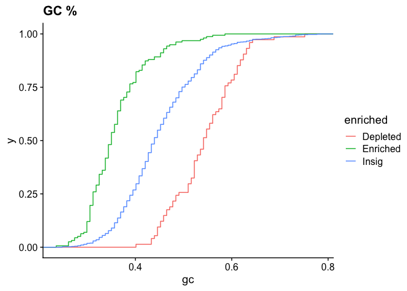<!-- -->

# 3. MS2 MPRNA-IP

Load raw count data.

``` r
load("RawData/final_4xMS2_pipeline.Rdata") # raw data
```

### FLAG vs. HA

FLAG

``` r
library(ggcorrplot)
temp <- matrix(rep(NA, 3*3), nrow=3, dimnames = list(c("Rep1", "Rep2", "Rep3"), c("Rep1", "Rep2", "Rep3")))
temp[cbind(1:nrow(temp), 1:nrow(temp))] <- 1
temp[1,2] <- cor.test(log2fc.table.flag$rep1.mean, log2fc.table.flag$rep2.mean)$estimate
temp[1,3] <- cor.test(log2fc.table.flag$rep1.mean, log2fc.table.flag$rep3.mean)$estimate
temp[2,3] <- cor.test(log2fc.table.flag$rep2.mean, log2fc.table.flag$rep3.mean)$estimate

p <- ggcorrplot(temp, type = "upper", lab = TRUE, lab_size = 5, show.diag = T, digits = 3, colors = c("gray", "gray", "gray"), outline.color = "black")
p
```

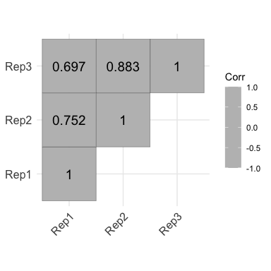<!-- -->

HA

``` r
temp <- matrix(rep(NA, 3*3), nrow=3, dimnames = list(c("Rep1", "Rep2", "Rep3"), c("Rep1", "Rep2", "Rep3")))
temp[cbind(1:nrow(temp), 1:nrow(temp))] <- 1
temp[1,2] <- cor.test(log2fc.table.ha$rep1.mean, log2fc.table.ha$rep2.mean)$estimate
temp[1,3] <- cor.test(log2fc.table.ha$rep1.mean, log2fc.table.ha$rep3.mean)$estimate
temp[2,3] <- cor.test(log2fc.table.ha$rep2.mean, log2fc.table.ha$rep3.mean)$estimate

p <- ggcorrplot(temp, type = "upper", lab = TRUE, lab_size = 5, show.diag = T, digits = 3, colors = c("gray", "gray", "gray"), outline.color = "black")
p
```

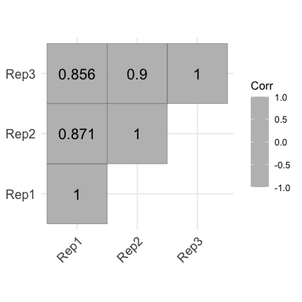<!-- -->

### Calculation of stem score

Load stem design information.

``` r
stem.design <- read.table("ms2_mt_stem.txt", header=T, sep="\t", stringsAsFactors = F)
stem.design$stemID <- paste(stem.design$idx, stem.design$mutation, sep="_")

# map to tileID
temp <- subset(tile.table, group=="Stem")
temp$stemID <- paste(temp$mutLoc, temp$mutType, sep="_")
stem.design$tileID <- temp$tileID[match(stem.design$stemID, temp$stemID)]

# Fix duplicated sequences in the assignment above.
temp <- split(stem.design, f = stem.design$seq)
temp <- lapply(temp, function(x) {idx <- which(!is.na(x$tileID)); if (length(idx==1)) {x$tileID<-x$tileID[idx]; return(x)} else {cat("Error"); return(0)}})
stem.design <- do.call(rbind, temp)
rownames(stem.design) <- 1:nrow(stem.design)
```

Initialize a main object.

``` r
stem.table <- dcast(stem.design, idx~mutation, value.var = "tileID")
colnames(stem.table) <- c("stemID", "tileID.mut3p", "tileID.mut5p", "tileID.comp")
stem.table <- stem.table[order(as.numeric(gsub("stem:", "", stem.table$stemID))), ]
```

GLM fitting

``` r
stem.glm.out <- data.frame(tileID=stem.table$stemID, n=NA, rpm=NA, p.seq.beta=NA, p.seq.sd=NA, p.seq.zval=NA, p.seq.pval=NA, p.stem.beta=NA, p.stem.sd=NA, p.stem.zval=NA, p.stem.pval=NA, poisson.overdisp=NA, poisson.overdisp.pval=NA, nb.seq.beta=NA, nb.seq.sd=NA, nb.seq.zval=NA, nb.seq.pval=NA, nb.stem.beta=NA, nb.stem.sd=NA, nb.stem.zval=NA, nb.stem.pval=NA, nb.alpha=NA, resid.diff=NA)
```

``` r
X.wt <- data.frame(mutType = rep("WT", each=BARCODE_NUM*REPLICATE_NUM*2), 
                  tileID = rep(subset(tile.table, group=="WT")$tileID, each=BARCODE_NUM*REPLICATE_NUM*2),
                  barcodeID = rep(paste0("Barcode:", 1:BARCODE_NUM), each=REPLICATE_NUM*2),
                  replicate = rep(rep(c("Rep1", "Rep2", "Rep3"), each=2), BARCODE_NUM),
                  pulldown = rep(rep(c("Input", "HA"), REPLICATE_NUM), BARCODE_NUM),
                  stringsAsFactors = F)

for (i in 1:nrow(stem.glm.out)) {
  #print(i)
  
  temp <- unlist(stem.table[i, c("tileID.mut5p", "tileID.mut3p", "tileID.comp"), drop=T])
  X.mut <- data.frame(mutType = rep(names(temp), each=BARCODE_NUM*REPLICATE_NUM*2), 
                  tileID = rep(temp, each=BARCODE_NUM*REPLICATE_NUM*2),
                  barcodeID = rep(rep(paste0("Barcode:", 1:BARCODE_NUM), each=REPLICATE_NUM*2), length(temp)),
                  replicate = rep(rep(rep(c("Rep1", "Rep2", "Rep3"), each=2), BARCODE_NUM), length(temp)),
                  pulldown = rep(rep(rep(c("Input", "HA"), REPLICATE_NUM), BARCODE_NUM), length(temp)),
                  stringsAsFactors = F)
  X <- rbind(X.wt, X.mut)
  X$oligoID <- paste(X$tileID, X$barcodeID, sep="_")
  
  X$seqEffect <- 0
  X$seqEffect[which(X$mutType %in% c("WT"))] <- 1

  X$stemEffect <- 0
  X$stemEffect[which(X$mutType %in% c("WT", "tileID.comp"))] <- 1

  y <- subset(count.table, (tileID %in% unique(X$tileID)) & (pulldown %in% c("Input", "HA")))
  
  # filter barcodes by input rpm
  rpm.th <- 1
  temp <- dcast(subset(y, pulldown=="Input"), barcodeID~., value.var = "rpm", fun.aggregate = mean)
  y <- subset(y, barcodeID %in% temp[temp[, 2]>=rpm.th, 1])
  if (length(unique(y$barcodeID))<3) {next; }

  # input of glm
  idx <- match(paste(y$oligoID, y$replicate, y$pulldown, sep="_"), paste(X$oligoID, X$replicate, X$pulldown, sep="_"))
  cur.data <- data.frame(X[idx, ], count=y$normalized, stringsAsFactors = F)
  cur.data$pulldown <- factor(cur.data$pulldown, levels=c("Input", "HA"))
  cur.data$rep <- factor(cur.data$rep)
  cur.data$seqEffect <- factor(cur.data$seqEffect)
  cur.data$stemEffect <- factor(cur.data$stemEffect)
  #if (min(table(cur.data$rep, cur.data$pulldown)) < 2) {next;}

  stem.glm.out$n[i] = nrow(y)
  stem.glm.out$rpm[i] = mean(y$rpm)

  # fitting
  fit.nb <- tryCatch( glm.nb(round(count) ~ replicate + pulldown + seqEffect + stemEffect + pulldown:seqEffect + pulldown:stemEffect, data=cur.data), error = function(err) { print("fit.nb"); print(err); return("err")})

  # test
  if (is.list(fit.nb)) {
    residual.nb <- round(cur.data$count)-fit.nb$fitted.values
    residual.z.nb <- residual.nb / sqrt(fit.nb$fitted.values)
    temp <- summary(fit.nb)
    stem.glm.out$nb.stem.beta[i] <- temp[["coefficients"]]["pulldownHA:stemEffect1", 1] # "Estimate"
    stem.glm.out$nb.stem.sd[i] <- temp[["coefficients"]]["pulldownHA:stemEffect1", 2] # "Std. Error"
    stem.glm.out$nb.stem.zval[i] <- temp[["coefficients"]]["pulldownHA:stemEffect1", 3] # "z value"
    stem.glm.out$nb.stem.pval[i] <- temp[["coefficients"]]["pulldownHA:stemEffect1", 4] # "Pr(>|z|)"
    
    stem.glm.out$nb.seq.beta[i] <- temp[["coefficients"]]["pulldownHA:seqEffect1", 1] # "Estimate"
    stem.glm.out$nb.seq.sd[i] <- temp[["coefficients"]]["pulldownHA:seqEffect1", 2] # "Std. Error"
    stem.glm.out$nb.seq.zval[i] <- temp[["coefficients"]]["pulldownHA:seqEffect1", 3] # "z value"
    stem.glm.out$nb.seq.pval[i] <- temp[["coefficients"]]["pulldownHA:seqEffect1", 4] # "Pr(>|z|)"

    stem.glm.out$nb.alpha[i] <- 1/temp$theta
  }
} 
```

Multiple test correction and select signficant stem mutations

``` r
stem.glm.out$nb.padj <- p.adjust(stem.glm.out$nb.stem.pval, method="fdr")

stem.table$n <- stem.glm.out$n
stem.table$rpm <- stem.glm.out$rpm
stem.table$stem.log2FC <- log2(exp(stem.glm.out$nb.stem.beta))
stem.table$seq.log2FC <- log2(exp(stem.glm.out$nb.seq.beta))
stem.table$stem.pval <- stem.glm.out$nb.stem.pval
stem.table$seq.pval <- stem.glm.out$nb.seq.pval
stem.table$padj <- stem.glm.out$nb.padj
stem.table$sig <- factor(stem.table$padj<0.05, levels=c("TRUE", "FALSE"), labels=c("Sig", "Insig"))
```

Stem score plot

``` r
temp <- stem.table
temp$stemEffect <- 2^(temp$stem.log2FC)

p <- ggdotchart(temp, x = "stemID", y = "stemEffect", dot.size=3, add = "segments", palette=c("red", "black"))
p <- p + geom_hline(yintercept = c(1,2), linetype="dashed")
p <- p + xlab("Stem ID") + ylab("Stem effect")
p <- p + ggtitle("Stem score")
p
```

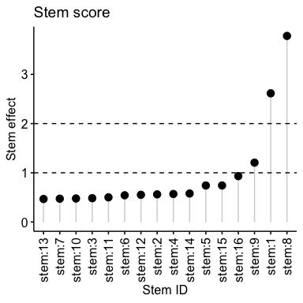<!-- -->

Fold change plot of “stem:8”

``` r
temp <- stem_log2FC_table("stem:8")
p <- ggboxplot(temp, x = "tileID", y = "log2FC", palette = "jco", add="jitter", add.params=list(size=1), outlier.shape=NA, legend = "none")
p <- p + stat_compare_means(comparisons = list( c("WT", "5' mut"), c("WT", "3' mut"), c("WT", "Comp. mut") ))
```

    ## [1] FALSE

``` r
p <- p + geom_hline(yintercept = 1, linetype="dashed")
p <- p + xlab("Mutation") + ylab("Log2 (HA/Input)")
p
```

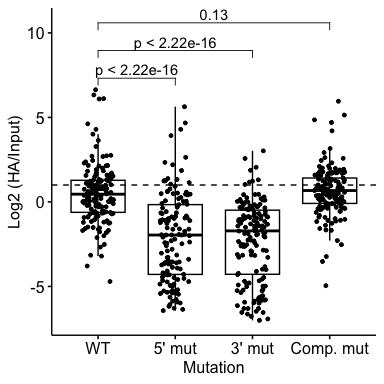<!-- -->

### Single mutation

Initialize a main object.

``` r
single.table <- subset(tile.table, group=="Single")[,c("tileID", "mutType", "mutLoc")]
temp <- strsplit(single.table$mutType, split="to")
single.table$seqWT <- sapply(temp, "[[", 1)
single.table$seqMT <- sapply(temp, "[[", 2)
```

GLM fitting

``` r
single.glm.out <- data.frame(tileID=single.table$tileID, n=NA, rpm=NA, poisson.beta=NA, poisson.sd=NA, poisson.zval=NA, poisson.pval=NA, poisson.overdisp=NA, poisson.overdisp.pval=NA, nb.beta=NA, nb.sd=NA, nb.zval=NA, nb.pval=NA, nb.alpha=NA, resid.diff=NA)
```

``` r
# WT object
X.wt <- data.frame(mutType = rep("WT", each=BARCODE_NUM*REPLICATE_NUM*2), 
                  tileID = rep(subset(tile.table, group=="WT")$tileID, each=BARCODE_NUM*REPLICATE_NUM*2),
                  barcodeID = rep(paste0("Barcode:", 1:BARCODE_NUM), each=REPLICATE_NUM*2),
                  replicate = rep(rep(c("Rep1", "Rep2", "Rep3"), each=2), BARCODE_NUM),
                  pulldown = rep(rep(c("Input", "HA"), REPLICATE_NUM), BARCODE_NUM),
                  betaMut = 0, 
                  stringsAsFactors = F)

for (i in 1:nrow(single.glm.out)) {
  
  # MT object
  X.mut <- data.frame(mutType = rep(single.table$mutType[i], each=BARCODE_NUM*REPLICATE_NUM*2), 
                      tileID = rep(single.table$tileID[i], each=BARCODE_NUM*REPLICATE_NUM*2),
                      barcodeID = rep(paste0("Barcode:", 1:BARCODE_NUM), each=REPLICATE_NUM*2),
                      replicate = rep(rep(c("Rep1", "Rep2", "Rep3"), each=2), BARCODE_NUM),
                      pulldown = rep(rep(c("Input", "HA"), REPLICATE_NUM), BARCODE_NUM),
                      betaMut = 1, 
                      stringsAsFactors = F)
  X <- rbind(X.wt, X.mut)
  X$oligoID <- paste(X$tileID, X$barcodeID, sep="_")
  
  y <- subset(count.table, tileID %in% unique(X$tileID) & pulldown %in% c("Input", "HA"))
  
  # filter barcodes by input rpm
  rpm.th <- 1
  temp <- dcast(subset(y, pulldown=="Input"), barcodeID~., value.var = "rpm", fun.aggregate = mean)
  y <- subset(y, barcodeID %in% temp[temp[, 2]>=rpm.th, 1])
  if (length(unique(y$barcodeID))<3) {next; }

  # input of glm
  idx <- match(paste(y$oligoID, y$replicate, y$pulldown, sep="_"), paste(X$oligoID, X$replicate, X$pulldown, sep="_"))
  cur.data <- data.frame(X[idx, ], count=y$normalized, stringsAsFactors = F)
  cur.data$pulldown <- factor(cur.data$pulldown, levels=c("Input", "HA"))
  cur.data$rep <- factor(cur.data$rep)
  cur.data$betaMut <- factor(cur.data$betaMut)
  #if (min(table(cur.data$rep, cur.data$pulldown)) < 2) {next;}

  single.glm.out$n[i] = nrow(y)
  single.glm.out$rpm[i] = mean(y$rpm)

  # fitting
  fit.nb <- tryCatch( glm.nb(round(count) ~ replicate + pulldown + betaMut + betaMut:pulldown, data=cur.data), error = function(err) { print("fit.nb"); print(err); return("err")})

  # test
  if (is.list(fit.nb)) {
    residual.nb <- round(cur.data$count)-fit.nb$fitted.values
    residual.z.nb <- residual.nb / sqrt(fit.nb$fitted.values)
    temp <- summary(fit.nb)
    single.glm.out$nb.beta[i] <- temp[["coefficients"]]["pulldownHA:betaMut1", 1] # "Estimate"
    single.glm.out$nb.sd[i] <- temp[["coefficients"]]["pulldownHA:betaMut1", 2] # "Std. Error"
    single.glm.out$nb.zval[i] <- temp[["coefficients"]]["pulldownHA:betaMut1", 3] # "z value"
    single.glm.out$nb.pval[i] <- temp[["coefficients"]]["pulldownHA:betaMut1", 4] # "Pr(>|z|)"
    single.glm.out$nb.alpha[i] <- 1/temp$theta
  }
}

single.glm.out$nb.padj <- p.adjust(single.glm.out$nb.pval, method="fdr")
```

Multiple test correction and select signficant mutations

``` r
single.table$n <- single.glm.out$n
single.table$rpm <- single.glm.out$rpm
single.table$log2FC <- log2(exp(single.glm.out$nb.beta))
single.table$pval <- single.glm.out$nb.pval
single.table$padj <- single.glm.out$nb.padj
single.table$sig <- factor(single.table$padj<0.05, levels=c("TRUE", "FALSE"), labels=c("Sig", "Insig"))
```

Summary plot (Suppl. Figure 5C)

``` r
temp <- single.table
temp$xlab <- paste(temp$mutLoc, temp$seqWT, sep=":")
temp$xlab <- factor(temp$xlab, levels=unique(temp$xlab))
temp$Sequence <- temp$seqMT
temp$P_value <- cut(temp$padj, breaks = c(0,0.1,0.2,0.3,1), labels=c("<=0.1", "<=0.2", "<=0.3", "<=1"))

p <- ggplot(temp, aes(x=xlab, y=2^log2FC, col=P_value, shape=Sequence))
p <- p + geom_segment(size=0.5, aes(xend=xlab), yend=0, color='grey80')
```

    ## Warning: Using `size` aesthetic for lines was deprecated in ggplot2 3.4.0.
    ## ℹ Please use `linewidth` instead.

``` r
p <- p + geom_point(size=3)
p <- p + scale_color_manual(values = c("red", "orange", "black", "blue"))
p <- p + geom_hline(yintercept = 1, linetype="dashed")
p <- p + xlab("Location on MS2") + ylab(expression(Delta* " (HA / Input)"))
p
```

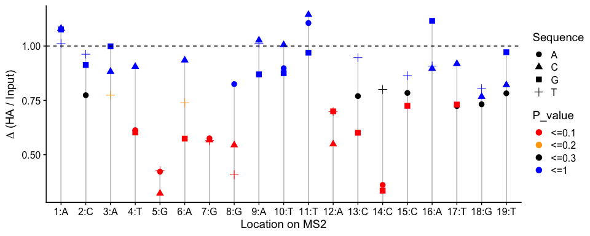<!-- -->

# 4. hTR MPRNA-IP

Load raw count data

``` r
load("RawData/final_hTR_pipeline.Rdata")
```

### Enrichment barplot

``` r
temp <- subset(count.table, type %in% c("Random", "Control"))
temp <- dcast(temp, type+coord+tileID+barcodeID+replicate~pulldown, value.var = "rpm")
temp$log2fc <- log2(temp$IP / temp$Input)
temp <- subset(temp, Input>=1) # RPM>=1
temp$fc <- 2^(temp$log2fc)

temp1 <- dcast(temp, coord~. , value.var="fc", mean)
temp1$se <- dcast(temp, coord~. , value.var="fc", function(x) {sd(x)/sqrt(length(x))})[,"."]
colnames(temp1) <- c("Tile", "Mean", "SE")
temp1$Tile <- factor(temp1$Tile, levels=c("Random", "hTR:34-190", "hTR:210-366", "hTR:295-451"), labels = c("Random", "Tile 1", "Tile 2", "Tile 3"))

p <- ggplot(temp1, aes(x=Tile, y=Mean, fill=Tile)) 
p <- p + geom_bar(stat="Identity")
p <- p + geom_errorbar(aes(ymin=Mean-SE, ymax=Mean+SE), size=0.8, width=0.5)
p <- p + scale_fill_manual(values=alpha(c("gray50", "orange", "red", "gray10"), 0.8))
p <- p + geom_hline(yintercept = 1, linetype="dashed")
p
```

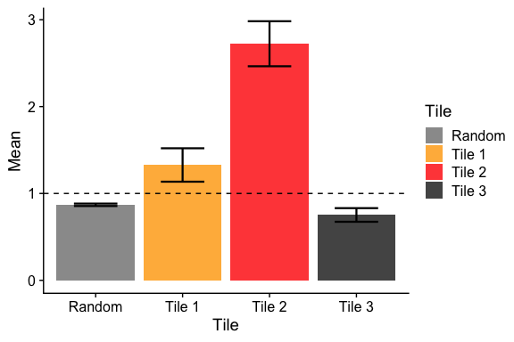<!-- -->

``` r
wilcox.test(subset(temp, coord=="Random")$fc, subset(temp, coord=="hTR:34-190")$fc)
```

    ## 
    ##  Wilcoxon rank sum test with continuity correction
    ## 
    ## data:  subset(temp, coord == "Random")$fc and subset(temp, coord == "hTR:34-190")$fc
    ## W = 64262, p-value = 0.004813
    ## alternative hypothesis: true location shift is not equal to 0

``` r
wilcox.test(subset(temp, coord=="Random")$fc, subset(temp, coord=="hTR:210-366")$fc)
```

    ## 
    ##  Wilcoxon rank sum test with continuity correction
    ## 
    ## data:  subset(temp, coord == "Random")$fc and subset(temp, coord == "hTR:210-366")$fc
    ## W = 15928, p-value < 2.2e-16
    ## alternative hypothesis: true location shift is not equal to 0

``` r
wilcox.test(subset(temp, coord=="Random")$fc, subset(temp, coord=="hTR:295-451")$fc)
```

    ## 
    ##  Wilcoxon rank sum test with continuity correction
    ## 
    ## data:  subset(temp, coord == "Random")$fc and subset(temp, coord == "hTR:295-451")$fc
    ## W = 193492, p-value = 0.7561
    ## alternative hypothesis: true location shift is not equal to 0

### Deletion and replacement tiles

Initialize a main object.

``` r
temp <- subset(tile.table, type =="Deletion")
temp$bpLocPair <- paste(temp$bpLoc5prime, temp$bpLoc3prime, sep=":")
deletion.table <- dcast(temp, coord+region+bpLocPair~mutation, value.var = "tileID")
colnames(deletion.table)[(ncol(deletion.table)-1):ncol(deletion.table)] <- c("tileID.del", "tileID.rep")

temp <- subset(tile.table, type=="Control")
deletion.table$tileID.wt <- temp$tileID[match(deletion.table$coord, temp$coord)]
```

GLM fitting for deletion

``` r
for (i in 1:nrow(deletion.table)) {
  temp <- unlist(deletion.table[i, c("tileID.wt", "tileID.del"), drop=T])
  X <- data.frame(mutation = rep(names(temp), each=BARCODE_NUM*REPLICATE_NUM*2), 
                  tileID = rep(temp, each=BARCODE_NUM*REPLICATE_NUM*2),
                  barcodeID = rep(rep(BARCODE_LIST, each=REPLICATE_NUM*2), length(temp)),
                  replicate = rep(rep(rep(REPLICATE_LIST, each=2), BARCODE_NUM), length(temp)),
                  pulldown = rep(rep(rep(c("Input", "IP"), REPLICATE_NUM), BARCODE_NUM), length(temp)),
                  stringsAsFactors = F)
  X$mutation <- sapply(strsplit(X$mutation, split="[.]"), "[[", 2)
  X$oligoID <- paste(X$tileID, X$barcodeID, sep="_")
  
  X$deletion <- 0  
  X$deletion[which(X$mutation %in% c("del"))] <- 1

  y <- subset(count.table, tileID %in% unique(X$tileID))
  y$id <- paste(y$replicate, y$oligoID, sep="_")
  #nrow(y)/2 == length(unique(y$id))
  
  # filter
  temp <- dcast(y, replicate+oligoID~pulldown, value.var = "rpm")
  temp <- temp[apply(temp[,c("Input", "IP")], 1, max) >= 1, ]
  y <- subset(y, id %in% paste(temp$replicate, temp$oligoID, sep="_"))
  
  idx <- match(paste(y$id, y$pulldown, sep="_"), paste(X$replicate, X$oligoID, X$pulldown, sep="_"))
  X <- X[idx, ]
  
  X$pulldown <- factor(X$pulldown, levels=c("Input", "IP"))
  X$deletion <- factor(X$deletion, levels=c(0,1))
  #fit <- glm.nb(round(y$rpm) ~ X$pulldown + X$betaMut + X$betaMut : X$pulldown + X$betaStem + X$betaStem : X$pulldown)
  fit <- glm.nb(round(y$normalized) ~ X$replicate + X$pulldown + X$deletion + X$pulldown : X$deletion)
  #summary(fit)
  if (i==1) {
    out <- summary(fit)[["coefficients"]]["X$pulldownIP:X$deletion1", ]
  } else {
    out <- rbind(out, summary(fit)[["coefficients"]]["X$pulldownIP:X$deletion1", ])
  }
}
colnames(out) <- paste0("del.", c("beta", "sd", "statistic", "pval"))
deletion.table <- cbind(deletion.table, out)
```

GLM fitting for Replacement

``` r
for (i in 1:nrow(deletion.table)) {
  temp <- unlist(deletion.table[i, c("tileID.wt", "tileID.rep"), drop=T])
  X <- data.frame(mutation = rep(names(temp), each=BARCODE_NUM*REPLICATE_NUM*2), 
                  tileID = rep(temp, each=BARCODE_NUM*REPLICATE_NUM*2),
                  barcodeID = rep(rep(BARCODE_LIST, each=REPLICATE_NUM*2), length(temp)),
                  replicate = rep(rep(rep(REPLICATE_LIST, each=2), BARCODE_NUM), length(temp)),
                  pulldown = rep(rep(rep(c("Input", "IP"), REPLICATE_NUM), BARCODE_NUM), length(temp)),
                  stringsAsFactors = F)
  X$mutation <- sapply(strsplit(X$mutation, split="[.]"), "[[", 2)
  X$oligoID <- paste(X$tileID, X$barcodeID, sep="_")
  
  X$deletion <- 0  
  X$deletion[which(X$mutation %in% c("rep"))] <- 1

  y <- subset(count.table, tileID %in% unique(X$tileID))
  y$id <- paste(y$replicate, y$oligoID, sep="_")
  #nrow(y)/2 == length(unique(y$id))
  
  # filter
  temp <- dcast(y, replicate+oligoID~pulldown, value.var = "rpm")
  temp <- temp[apply(temp[,c("Input", "IP")], 1, max) >= 1, ]
  y <- subset(y, id %in% paste(temp$replicate, temp$oligoID, sep="_"))
  
  idx <- match(paste(y$id, y$pulldown, sep="_"), paste(X$replicate, X$oligoID, X$pulldown, sep="_"))
  X <- X[idx, ]
  
  X$pulldown <- factor(X$pulldown, levels=c("Input", "IP"))
  X$deletion <- factor(X$deletion, levels=c(0,1))
  #fit <- glm.nb(round(y$rpm) ~ X$pulldown + X$betaMut + X$betaMut : X$pulldown + X$betaStem + X$betaStem : X$pulldown)
  fit <- glm.nb(round(y$normalized) ~ X$replicate + X$pulldown + X$deletion + X$pulldown : X$deletion)
  #summary(fit)
  if (i==1) {
    out <- summary(fit)[["coefficients"]]["X$pulldownIP:X$deletion1", ]
  } else {
    out <- rbind(out, summary(fit)[["coefficients"]]["X$pulldownIP:X$deletion1", ])
  }
}
colnames(out) <- paste0("rep.", c("beta", "sd", "statistic", "pval"))
deletion.table <- cbind(deletion.table, out)
```

Multiple test correction

``` r
deletion.table$del.padj <- p.adjust(deletion.table$del.pval, method="fdr")
deletion.table$rep.padj <- p.adjust(deletion.table$rep.pval, method="fdr")
```

A summary figure

``` r
temp <- subset(deletion.table, coord!="hTR:295-451")
temp$region <- factor(temp$region, levels=temp$region)
temp$Tile <- factor(temp$coord, levels=c("hTR:34-190", "hTR:210-366"), labels=c("Pesudoknot", "CR4/CR5"))
temp$log2fc1 <- log2(exp(temp$del.beta))
temp$Significance1 <- factor(temp$del.padj<0.05)
table(temp$Significance1)
```

    ## 
    ## FALSE  TRUE 
    ##    10     2

``` r
temp$log2fc2 <- log2(exp(temp$rep.beta))
temp$Significance2 <- factor(temp$rep.padj<0.05)
table(temp$Significance2)
```

    ## 
    ## FALSE 
    ##    12

``` r
p <- ggplot(temp, aes(x=region, y=log2fc1, col=Significance1), shape="circle")
p <- p + geom_point(size=3)
p <- p + geom_point(aes(y=log2fc2, col=Significance2), size=6, shape="triangle")
p <- p + scale_color_manual(values=c("black", "red"))
p <- p + geom_segment(size=0.7, aes(xend=region, yend=log2fc2), color='blue')
p <- p + geom_hline(yintercept = 0, linetype="dashed")
p <- p + xlab("Tile region") + ylab("Log2FC")
p <- p + background_grid() 
p
```

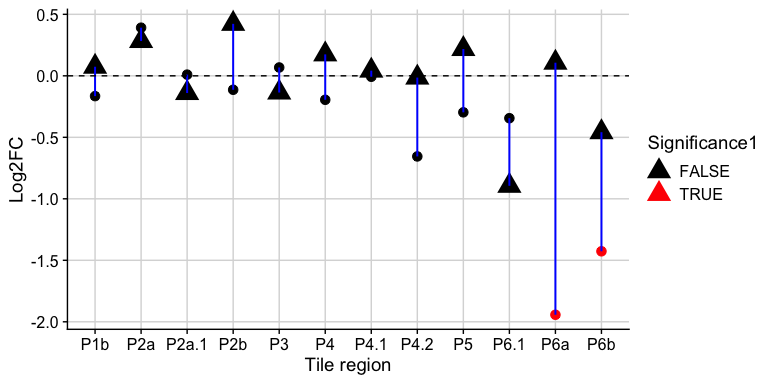<!-- -->

Effect size

``` r
temp <- subset(deletion.table, coord!="hTR:295-451")
temp$fc <- exp(temp$del.beta)
dcast(temp, coord~., value.var="fc", fun.aggregate=mean)
```

    ##         coord        .
    ## 1  hTR:34-190 1.036575
    ## 2 hTR:210-366 0.676701

### Compensatory mutation analysis

Initialize a main object.

``` r
temp <- subset(tile.table, type %in% c("Mut1bp", "Mut4bp"))
temp$bpLocPair <- paste(temp$bpLoc5prime, temp$bpLoc3prime, sep=":")
stem.table <- dcast(temp, type+coord+region+bpLocPair~mutation, value.var = "tileID")
colnames(stem.table)[(ncol(stem.table)-2):ncol(stem.table)] <- c("tileID.mut3p", "tileID.mut5p", "tileID.comp")

temp <- subset(tile.table, type=="Control")
stem.table$tileID.wt <- temp$tileID[match(stem.table$coord, temp$coord)]
```

GLM fitting

``` r
for (i in 1:nrow(stem.table)) {
  temp <- unlist(stem.table[i, c("tileID.wt", "tileID.mut5p", "tileID.mut3p", "tileID.comp"), drop=T])
  X <- data.frame(mutation = rep(names(temp), each=BARCODE_NUM*REPLICATE_NUM*2), 
                  tileID = rep(temp, each=BARCODE_NUM*REPLICATE_NUM*2),
                  barcodeID = rep(rep(BARCODE_LIST, each=REPLICATE_NUM*2), length(temp)),
                  replicate = rep(rep(rep(REPLICATE_LIST, each=2), BARCODE_NUM), length(temp)),
                  pulldown = rep(rep(rep(c("Input", "IP"), REPLICATE_NUM), BARCODE_NUM), length(temp)),
                  stringsAsFactors = F)
  X$mutation <- sapply(strsplit(X$mutation, split="[.]"), "[[", 2)
  X$oligoID <- paste(X$tileID, X$barcodeID, sep="_")

  X$seqEffect <- 0
  X$seqEffect[which(X$mutation %in% c("wt"))] <- 1

  X$stemEffect <- 0
  X$stemEffect[which(X$mutation %in% c("wt", "comp"))] <- 1

  y <- subset(count.table, tileID %in% unique(X$tileID))
  y$id <- paste(y$replicate, y$oligoID, sep="_")
  #nrow(y)/2 == length(unique(y$id))
  
  # filter
  temp <- dcast(y, replicate+oligoID~pulldown, value.var = "rpm")
  temp <- temp[apply(temp[,c("Input", "IP")], 1, max) >= 1, ]
  y <- subset(y, id %in% paste(temp$replicate, temp$oligoID, sep="_"))
  
  idx <- match(paste(y$id, y$pulldown, sep="_"), paste(X$replicate, X$oligoID, X$pulldown, sep="_"))
  X <- X[idx, ]
  
  X$pulldown <- factor(X$pulldown, levels=c("Input", "IP"))
  X$seqEffect <- factor(X$seqEffect, levels=c(0,1))
  X$stemEffect <- factor(X$stemEffect, levels=c(0,1))
  fit <- glm.nb(round(y$normalized) ~ X$replicate + X$pulldown + X$seqEffect + X$stemEffect + X$seqEffect : X$pulldown + X$stemEffect : X$pulldown)
  temp <- summary(fit)[["coefficients"]]
  if (i==1) {
    out <- c(mean(y$rpm), temp["X$pulldownIP:X$stemEffect1", ],temp["X$pulldownIP:X$seqEffect1", ])
  } else {
    out <- rbind(out, c(mean(y$rpm), temp["X$pulldownIP:X$stemEffect1", ],temp["X$pulldownIP:X$seqEffect1", ]))
  }
}
colnames(out) <- c("rpm.mean", paste0("bp.", c("beta", "sd", "statistic", "pval")), paste0("seq.", c("beta", "sd", "statistic", "pval")))
stem.table <- cbind(stem.table, out)
```

Multiple test correction and select signficant stem mutation

``` r
stem.table$bp.padj <- p.adjust(stem.table$bp.pval, method="fdr")

stem.table$bp.sig <- factor(stem.table$bp.padj<0.05, levels=c(TRUE, FALSE), labels=c("Sig", "Insig"))
table(stem.table$bp.sig)
```

    ## 
    ##   Sig Insig 
    ##    10   149

Dotplot of 4bp mutation beta (Suppl. Figure 7A)

``` r
temp <- subset(stem.table, coord!="hTR:295-451" & type=="Mut4bp")
temp$effect <- exp(temp$bp.beta)
temp$stemID <- paste(temp$region, temp$bpLocPair, sep="_")

p <- ggdotchart(temp, x = "stemID", y = "effect", col="bp.sig", dot.size=3, add = "segments", palette=c("red", "black"))
p <- p + geom_hline(yintercept = 1, linetype="dashed")
p <- p + xlab("Stem ID") + ylab("Stem score")
p
```

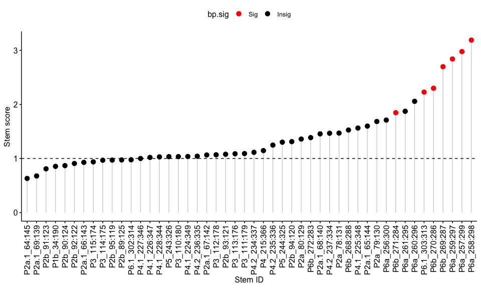<!-- -->

Dotplot of 1bp mutation beta

``` r
temp <- subset(stem.table, coord!="hTR:295-451" & type=="Mut1bp")
temp$effect <- exp(temp$bp.beta)
temp$stemID <- paste(temp$region, temp$bpLocPair, sep="_")

p <- ggdotchart(temp, x = "stemID", y = "effect", col="bp.sig", dot.size=4, add = "segments", palette=c("red", "black"))
p <- p + geom_hline(yintercept = 1, linetype="dashed")
p <- p + theme(axis.text.x=element_text(angle=70, hjust=1, vjust=1))
p <- p + xlab("Stem ID") + ylab("Stem score")
p
```

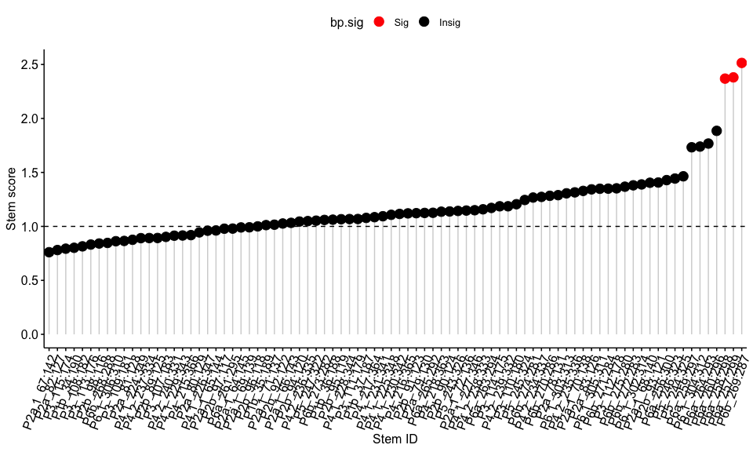<!-- -->

Log2FC plot

``` r
temp <- hTR_stem_log2FC_table("Mut4bp", "hTR:210-366", "258:298")
temp <- subset(temp, Input>=1)
temp$log2FC <- log2(temp$IP+1) - log2(temp$Input+1)
p <- ggboxplot(temp, x = "tileID", y = "log2FC", outlier.shape=NA, legend = "none")
p <- p + stat_compare_means(comparisons = list( c("WT", "5' mut"), c("WT", "3' mut"), c("WT", "Comp. mut") ))
```

    ## [1] FALSE

``` r
p <- p + geom_jitter(aes(col=replicate), size=2, width = 0.2, height=0)
p <- p + scale_color_manual(values=c("darkcyan", "black", "brown"))
p <- p + geom_hline(yintercept = 1, linetype="dashed")
p
```

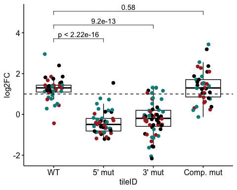<!-- -->

Log2FC plot

``` r
temp <- hTR_stem_log2FC_table("Mut4bp", "hTR:210-366", "303:313")
temp <- subset(temp, Input>=1)
temp$log2FC <- log2(temp$IP+1) - log2(temp$Input+1)
p <- ggboxplot(temp, x = "tileID", y = "log2FC", outlier.shape=NA, legend = "none")
p <- p + stat_compare_means(comparisons = list( c("WT", "5' mut"), c("WT", "3' mut"), c("WT", "Comp. mut") ))
```

    ## [1] FALSE

``` r
p <- p + geom_jitter(aes(col=replicate), size=2, width = 0.2, height=0)
p <- p + scale_color_manual(values=c("darkcyan", "black", "brown"))
p <- p + geom_hline(yintercept = 1, linetype="dashed")
p
```

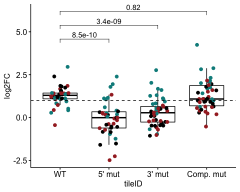<!-- -->

Log2FC plot

``` r
temp <- hTR_stem_log2FC_table("Mut4bp", "hTR:210-366", "243:326")
temp <- subset(temp, Input>=1)
temp$log2FC <- log2(temp$IP+1) - log2(temp$Input+1)
p <- ggboxplot(temp, x = "tileID", y = "log2FC", outlier.shape=NA, legend = "none")
p <- p + stat_compare_means(comparisons = list( c("WT", "5' mut"), c("WT", "3' mut"), c("WT", "Comp. mut") ))
```

    ## [1] FALSE

``` r
p <- p + geom_jitter(aes(col=replicate), size=2, width = 0.2, height=0)
p <- p + scale_color_manual(values=c("darkcyan", "black", "brown"))
p <- p + geom_hline(yintercept = 1, linetype="dashed")
p
```

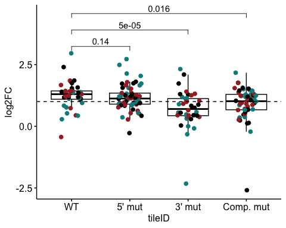<!-- -->

# R session information

``` r
sessionInfo()
```

    ## R version 4.2.2 (2022-10-31)
    ## Platform: x86_64-apple-darwin17.0 (64-bit)
    ## Running under: macOS Big Sur ... 10.16
    ## 
    ## Matrix products: default
    ## BLAS:   /Library/Frameworks/R.framework/Versions/4.2/Resources/lib/libRblas.0.dylib
    ## LAPACK: /Library/Frameworks/R.framework/Versions/4.2/Resources/lib/libRlapack.dylib
    ## 
    ## locale:
    ## [1] en_US.UTF-8/en_US.UTF-8/en_US.UTF-8/C/en_US.UTF-8/en_US.UTF-8
    ## 
    ## attached base packages:
    ## [1] stats4    stats     graphics  grDevices utils     datasets  methods  
    ## [8] base     
    ## 
    ## other attached packages:
    ##  [1] ggcorrplot_0.1.4     GenomicRanges_1.50.2 GenomeInfoDb_1.34.9 
    ##  [4] IRanges_2.32.0       S4Vectors_0.36.1     BiocGenerics_0.44.0 
    ##  [7] MASS_7.3-58.2        edgeR_3.40.2         limma_3.54.1        
    ## [10] reshape2_1.4.4       dplyr_1.0.10         gridExtra_2.3       
    ## [13] GGally_2.1.2         ggpubr_0.5.0         ggrepel_0.9.2       
    ## [16] ggplot2_3.4.0        cowplot_1.1.1       
    ## 
    ## loaded via a namespace (and not attached):
    ##  [1] Rcpp_1.0.10            locfit_1.5-9.7         lattice_0.20-45       
    ##  [4] tidyr_1.3.0            assertthat_0.2.1       digest_0.6.31         
    ##  [7] utf8_1.2.2             R6_2.5.1               plyr_1.8.8            
    ## [10] backports_1.4.1        evaluate_0.20          highr_0.10            
    ## [13] pillar_1.8.1           zlibbioc_1.44.0        rlang_1.0.6           
    ## [16] rstudioapi_0.14        car_3.1-1              Matrix_1.5-3          
    ## [19] rmarkdown_2.20         labeling_0.4.2         splines_4.2.2         
    ## [22] stringr_1.5.0          RCurl_1.98-1.10        munsell_0.5.0         
    ## [25] broom_1.0.3            compiler_4.2.2         xfun_0.36             
    ## [28] pkgconfig_2.0.3        mgcv_1.8-41            htmltools_0.5.4       
    ## [31] tidyselect_1.2.0       tibble_3.1.8           GenomeInfoDbData_1.2.9
    ## [34] reshape_0.8.9          fansi_1.0.4            withr_2.5.0           
    ## [37] bitops_1.0-7           grid_4.2.2             nlme_3.1-161          
    ## [40] gtable_0.3.1           lifecycle_1.0.3        DBI_1.1.3             
    ## [43] magrittr_2.0.3         scales_1.2.1           cli_3.6.0             
    ## [46] stringi_1.7.12         carData_3.0-5          farver_2.1.1          
    ## [49] XVector_0.38.0         ggsignif_0.6.4         generics_0.1.3        
    ## [52] vctrs_0.5.2            ggsci_2.9              RColorBrewer_1.1-3    
    ## [55] tools_4.2.2            glue_1.6.2             purrr_1.0.1           
    ## [58] abind_1.4-5            fastmap_1.1.0          yaml_2.3.7            
    ## [61] colorspace_2.1-0       rstatix_0.7.2          knitr_1.42
