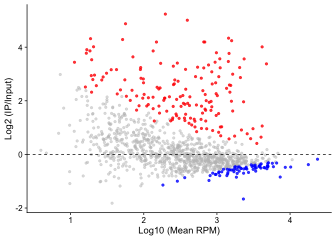
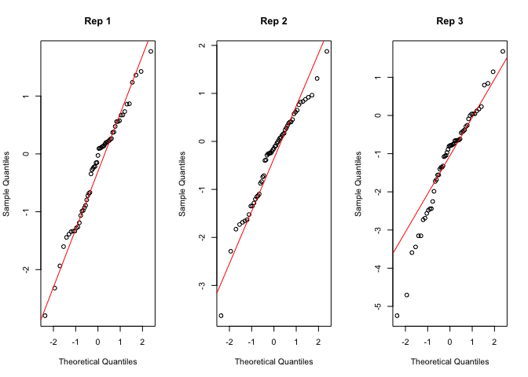
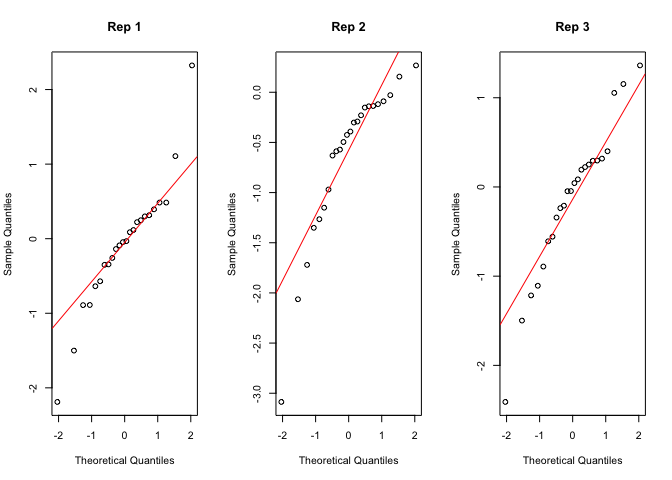
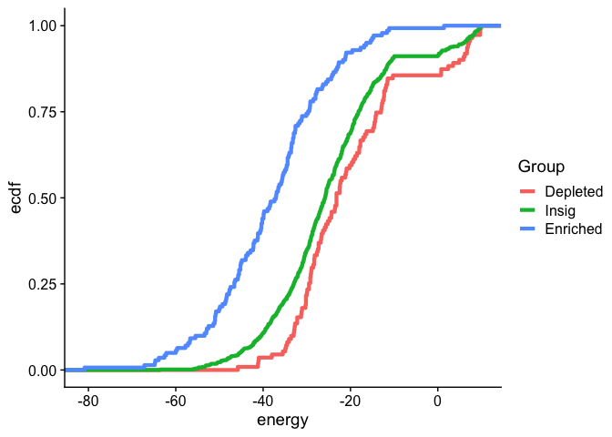

R codes for statistical analyses of MPRNA-IP data
================
Taeyoung Hwang, PhD
February 7, 2024

``` r
library(cowplot)
library(ggrepel)
library(ggpubr)

library(dplyr)
library(reshape2)

library(edgeR)
```

``` r
theme_set(theme_cowplot())
source("nar_functions.R")
```

# 1. PUM2-RNA MPRNA-IP

### Load raw count data and tile annotations.

``` r
load("RawData/git_PUM2_raw.Rdata")
BARCODE_NUM <- 22
REPLICATE_NUM <- 3
```

### Filtering and pooling

``` r
pooled.count <- oligoFilter(oligo.count, inputFilterBy="rpm", inputTh=1, ipFilterBy="rpm", ipTh=1) %>% countPooler()
```

    ## Proportion of oligos after filtering:  0.2632043 
    ## Proportion of tiles after filtering and pooling:  0.7023139

``` r
pooled.fastqc <- fastqc[match(colnames(pooled.count), fastqc$SampleID),]
pooled.fastqc <- droplevels(pooled.fastqc) 
```

### Enrichment

Limma + Voom

``` r
pooled.model <- model.matrix(data= pooled.fastqc, ~ 0 + Pulldown + Repl)
edgeR.obj <- DGEList(pooled.count)
edgeR.obj <- calcNormFactors(edgeR.obj, method="TMM")
y <- voom(edgeR.obj, pooled.model, plot = T)
```

<!-- -->

``` r
fit <- lmFit(y, pooled.model)
contr <- makeContrasts(PulldownIP - PulldownInput, levels = colnames(coef(fit)))
out <- contrasts.fit(fit, contr)
out <- eBayes(out)
out.table <- topTable(out, sort.by = "P", n = Inf)
table(out.table$adj.P.Val<0.01, out.table$logFC>0)
```

    ##        
    ##         FALSE TRUE
    ##   FALSE   496  395
    ##   TRUE     74  158

Significant tiles

``` r
tile.table <- data.frame(tileID=tile.annot$tileID, stringsAsFactors = F)
idx <- match(tile.table$tileID, rownames(out.table))
tile.table$rpm <- 2^out.table$AveExpr[idx]
tile.table$log2FC <- out.table$logFC[idx]
tile.table$stat <- out.table$t[idx]
tile.table$pval <- out.table$P.Value[idx]
tile.table$padj <- out.table$adj.P.Val[idx]
tile.table$sig <- factor(tile.table$padj<0.01, levels=c("TRUE", "FALSE"), labels=c("Sig", "Insig"))

tile.table$enriched <- NA
tile.table$enriched[!is.na(tile.table$stat)] <- "Insig"
tile.table$enriched[which(tile.table$sig=="Sig" & tile.table$log2FC>0)] <- "Enriched"
tile.table$enriched[which(tile.table$sig=="Sig" & tile.table$log2FC<0)] <- "Depleted"
table(tile.table$enriched)
```

    ## 
    ## Depleted Enriched    Insig 
    ##       74      158      891

MA plot

``` r
p <- ggplot(subset(tile.table, !is.na(log2FC)), aes(x=log10(rpm), y=log2FC))
p <- p + geom_point(data=subset(tile.table, enriched=="Insig"), col="gray", alpha=0.5)
p <- p + geom_point(data=subset(tile.table, enriched=="Depleted"), col="blue", alpha=0.8)
p <- p + geom_point(data=subset(tile.table, enriched=="Enriched"), col="red", alpha=0.8)
p <- p + geom_hline(yintercept = 0, linetype="dashed")
p <- p + xlab("Log10 (Mean RPM)") + ylab("Log2 (IP/Input)")
p
```

<!-- -->

### Analysis

PRE effect on fold change

``` r
temp <- subset(tile.table, !is.na(log2FC))
temp$pre.num <- tile.annot$pre.num[match(temp$tileID, tile.annot$tileID)]
table(temp$pre.num)
```

    ## 
    ##    0    1    2 
    ## 1043   71    9

``` r
p <- ggviolin(temp, x="pre.num", y="log2FC", color="pre.num", palette=c("black", "blue", "red"), alpha=1, add="jitter", add.params=list(size=1, alpha=0.7))
p <- p + stat_compare_means(comparisons = list( c("0", "1"), c("1", "2") ), size=5)
p <- p + geom_hline(yintercept = 0, linetype="dashed")
p
```

<!-- -->

GC %

``` r
temp <- cbind(tile.annot, tile.table[,-1])
temp <- subset(temp, !is.na(enriched))
p <- ggplot(temp, aes(col=enriched, gc))
p <- p + stat_ecdf()
p
```

<!-- -->

# 2. MS2-MCP MPRNA-IP

### Load raw count data and tile annotations.

``` r
load("RawData/git_ms2_raw.Rdata")
BARCODE_NUM <- 50
REPLICATE_NUM <- 3
```

Select Input and HA pulldown

``` r
oligo.count <- subset(oligo.count, sample %in% c("rep1in", "rep1ha","rep2in", "rep2ha","rep3in", "rep3ha"))
oligo.count$pulldown <- gsub("HA", "IP" , oligo.count$pulldown)
```

Tidy

``` r
oligo.count <- oligo.count[, c("tileID", "barcodeID", "repl", "pulldown", "raw", "rpm")]
rownames(oligo.count) <- 1:nrow(oligo.count)
```

### Normalization

``` r
temp <- dcast(oligo.count, tileID+barcodeID~repl+pulldown, value.var="raw")
count.normed <- edgeR::calcNormFactors(edgeR::DGEList(as.matrix(temp[, -c(1,2)])), method="TMM")
count.normed <- edgeR::cpm(count.normed)

temp <- melt(cbind(temp[, c(1,2)], count.normed), id.vars=c("tileID", "barcodeID"), value.name = "normed", variable.name = "sampleID")
idx <- match(paste(oligo.count$tileID, oligo.count$barcodeID, oligo.count$repl, oligo.count$pulldown, sep="_") , paste(temp$tileID, temp$barcodeID, temp$sampleID, sep="_"))
oligo.count$normed <- temp$normed[idx]
```

### Single mutation

Single mutation table

``` r
single.table <- subset(tile.annot, group=="Single")[, c("tileID", "mutType", "mutLoc")]
temp <- strsplit(single.table$mutType, split="to")
single.table$seqWT <- sapply(temp, "[[", 1)
single.table$seqMT <- sapply(temp, "[[", 2)
```

Limma for individual replicates

``` r
temp <- data.frame(mutID=paste(single.table$mutLoc, single.table$mutType, sep="_"), tileID.mut=single.table$tileID, tileID.wt=subset(tile.annot, group=="WT")$tileID)

single.rep1 <- runLimma.singleMut(temp, "Rep1", 1)
```

    ## Check the number of pseudo (barcode) samples: 
    ##      
    ##       Input IP
    ##   mut    50 50
    ##   wt     50 50
    ##  ==> Should be equal to: 50

``` r
single.rep2 <- runLimma.singleMut(temp, "Rep2", 1)
```

    ## Check the number of pseudo (barcode) samples: 
    ##      
    ##       Input IP
    ##   mut    50 50
    ##   wt     50 50
    ##  ==> Should be equal to: 50

``` r
single.rep3 <- runLimma.singleMut(temp, "Rep3", 1)
```

    ## Check the number of pseudo (barcode) samples: 
    ##      
    ##       Input IP
    ##   mut    50 50
    ##   wt     50 50
    ##  ==> Should be equal to: 50

Merge and p-value based on rank

``` r
temp <- mergeLimmaResults(list(single.rep1$limma, single.rep2$limma, single.rep3$limma))
```

    ## Note that rank-based p-value assumption: ordinal scores follow an approximate normal distribution.

    ## 

<!-- -->

``` r
single.table <- cbind(single.table, temp)
rownames(single.table) <- rownames(temp)
```

Result

``` r
temp <- single.table
temp$seqWT <- gsub("T", "U", temp$seqWT)
temp$seqMT <- gsub("T", "U", temp$seqMT)
temp$xlab <- paste(temp$mutLoc, temp$seqWT, sep=":")
temp$xlab <- factor(temp$xlab, levels=unique(temp$xlab))
temp$Sequence <- temp$seqMT
temp$FDR <- cut(temp$qval, breaks = c(0,0.1,1), labels=c("<=0.1", "<=1"))

p <- ggplot(temp, aes(x=xlab, y=2^mean.logFC, col=FDR, shape=Sequence))
p <- p + geom_segment(linewidth=0.5, aes(xend=xlab), yend=0, color='grey80')
p <- p + geom_point(size=3)
p <- p + scale_color_manual(values = c("red", "black"))
p <- p + geom_hline(yintercept = 1, linetype="dashed")
p <- p + theme(axis.text.x=element_text(size=15, angle=70, hjust=1, vjust=1, color = "black"))
p <- p + xlab("Location on MS2") + ylab(expression(Delta* " (HA / Input)"))
p
```

<!-- -->

### Stem mutation effect

Stem mutant table

``` r
# stem mutant table was pre-made.
```

Limma for individual replicates

``` r
stem.rep1 <- runLimma.stemMut(stem.table, "Rep1", 1)
```

    ## Check the number of pseudo (barcode) samples: 
    ##        
    ##         Input IP
    ##   comp     50 50
    ##   mut3p    50 50
    ##   mut5p    50 50
    ##   wt       50 50
    ##  ==> Should be equal to: 50

``` r
stem.rep2 <- runLimma.stemMut(stem.table, "Rep2", 1)
```

    ## Check the number of pseudo (barcode) samples: 
    ##        
    ##         Input IP
    ##   comp     50 50
    ##   mut3p    50 50
    ##   mut5p    50 50
    ##   wt       50 50
    ##  ==> Should be equal to: 50

``` r
stem.rep3 <- runLimma.stemMut(stem.table, "Rep3", 1)
```

    ## Check the number of pseudo (barcode) samples: 
    ##        
    ##         Input IP
    ##   comp     50 50
    ##   mut3p    50 50
    ##   mut5p    50 50
    ##   wt       50 50
    ##  ==> Should be equal to: 50

Merge and p-value based on rank of t-statistics

``` r
temp <- mergeLimmaResults(list(stem.rep1$limma, stem.rep2$limma, stem.rep3$limma))
```

    ## Note that rank-based p-value assumption: ordinal scores follow an approximate normal distribution.

<!-- -->

``` r
stem.table <- cbind(stem.table, temp)
rownames(stem.table) <- rownames(temp)
```

Results

``` r
temp <- stem.table
temp$stemEffect <- 2^(temp$mean.logFC)
temp$FDR <- cut(temp$qval, breaks = c(0,0.1,1))

p <- ggpubr::ggdotchart(temp, x = "stemID", y = "stemEffect", col="FDR", dot.size=5, add = "segments", palette=c("red", "black"))
p <- p + geom_hline(yintercept = c(1,2), linetype="dashed")
p
```

<!-- -->

Examples

``` r
temp <- stem_log2FC_tabler("stem:8")
table(temp$tileID) # WT: 142, 5' mut: 76, 3' mut: 107, Comp. mut: 146
```

    ## 
    ##        WT    5' mut    3' mut Comp. mut 
    ##       142        76       107       146

``` r
p <- ggpubr::ggboxplot(temp, x = "tileID", y = "log2FC", palette = "jco", add="jitter", add.params=list(size=2), outlier.shape=NA, legend = "none")
p <- p + ggpubr::stat_compare_means(comparisons = list( c("WT", "5' mut"), c("WT", "3' mut"), c("WT", "Comp. mut") ))
p <- p + geom_hline(yintercept = mean(subset(temp, tileID=="WT")$log2FC), linetype="dashed")
p # p-value: 1.4e-5, 1.1e-14, 0.047
```

<!-- -->

# 3. hTR-FlagTERT MPRNA-IP

### Load raw count data and tile annotations.

``` r
load("RawData/git_hTR_raw.Rdata")

BARCODE_NUM <- 25
REPLICATE_NUM <- 3
```

### Tile Enrichment

``` r
temp <- cbind(oligo.count, tile.annot[match(oligo.count$tileID, tile.annot$tileID),-1]) 
temp <- subset(temp, type %in% c("Random", "Control"))

temp <- dcast(temp, type+coord+tileID+barcodeID+repl~pulldown, value.var = "rpm")
temp$log2fc <- log2((temp$IP+1) / (temp$Input+1))
temp <- subset(temp, Input>=1 & IP>=1) # RPM>=1
table(temp$coord) # 32, 39, 60, 5679
```

    ## 
    ##  hTR:34-190 hTR:210-366 hTR:295-451      Random 
    ##          32          39          60        5679

``` r
temp$fc <- 2^(temp$log2fc)
wilcox.test(subset(temp, coord=="Random")$fc, subset(temp, coord=="hTR:34-190")$fc) # p-value = 6.332e-06
```

    ## 
    ##  Wilcoxon rank sum test with continuity correction
    ## 
    ## data:  subset(temp, coord == "Random")$fc and subset(temp, coord == "hTR:34-190")$fc
    ## W = 48871, p-value = 6.332e-06
    ## alternative hypothesis: true location shift is not equal to 0

``` r
wilcox.test(subset(temp, coord=="Random")$fc, subset(temp, coord=="hTR:210-366")$fc) # p-value < 2.2e-16
```

    ## 
    ##  Wilcoxon rank sum test with continuity correction
    ## 
    ## data:  subset(temp, coord == "Random")$fc and subset(temp, coord == "hTR:210-366")$fc
    ## W = 16319, p-value < 2.2e-16
    ## alternative hypothesis: true location shift is not equal to 0

``` r
wilcox.test(subset(temp, coord=="Random")$fc, subset(temp, coord=="hTR:295-451")$fc) # p-value = 0.2652
```

    ## 
    ##  Wilcoxon rank sum test with continuity correction
    ## 
    ## data:  subset(temp, coord == "Random")$fc and subset(temp, coord == "hTR:295-451")$fc
    ## W = 184596, p-value = 0.2652
    ## alternative hypothesis: true location shift is not equal to 0

``` r
wilcox.test(subset(temp, coord=="hTR:34-190")$fc, subset(temp, coord=="hTR:210-366")$fc) # p-value = 0.0007099
```

    ## 
    ##  Wilcoxon rank sum exact test
    ## 
    ## data:  subset(temp, coord == "hTR:34-190")$fc and subset(temp, coord == "hTR:210-366")$fc
    ## W = 336, p-value = 0.0007099
    ## alternative hypothesis: true location shift is not equal to 0

``` r
temp1 <- dcast(temp, coord~. , value.var="fc", mean)
temp1$se <- dcast(temp, coord~. , value.var="fc", function(x) {sd(x)/sqrt(length(x))})[,"."]
colnames(temp1) <- c("Tile", "Mean", "SE")
temp1$Tile <- factor(temp1$Tile, levels=c("Random", "hTR:34-190", "hTR:210-366", "hTR:295-451"), labels = c("Random", "Tile 1", "Tile 2", "Tile 3"))

p <- ggplot(temp1, aes(x=Tile, y=Mean, fill=Tile)) 
p <- p + geom_bar(stat="Identity")
p <- p + geom_errorbar(aes(ymin=Mean-SE, ymax=Mean+SE), linewidth=0.8, width=0.5)
p <- p + scale_fill_manual(values=alpha(c("gray50", "orange", "red", "gray10"), 0.8))
p <- p + geom_hline(yintercept = 1, linetype="dashed")
p
```

<!-- -->

``` r
# effect size
temp1 # tile1: 1.65, tile2: 2.25
```

    ##     Tile      Mean         SE
    ## 1 Tile 1 1.6535817 0.29059948
    ## 2 Tile 2 2.2534334 0.19034641
    ## 3 Tile 3 0.6592327 0.06393704
    ## 4 Random 0.8199145 0.01236395

### Normalization

``` r
temp <- dcast(oligo.count, tileID+barcodeID~repl+pulldown, value.var="raw")
count.normed <- edgeR::calcNormFactors(edgeR::DGEList(as.matrix(temp[, -c(1,2)])), method="TMM")
count.normed <- edgeR::cpm(count.normed)

temp <- melt(cbind(temp[, c(1,2)], count.normed), id.vars=c("tileID", "barcodeID"), value.name = "normed", variable.name = "sampleID")
idx <- match(paste(oligo.count$tileID, oligo.count$barcodeID, oligo.count$repl, oligo.count$pulldown, sep="_") , paste(temp$tileID, temp$barcodeID, temp$sampleID, sep="_"))
oligo.count$normed <- temp$normed[idx]
```

### Deletion and replace

Deletion (and replace) table

``` r
deletion.table <- subset(tile.annot, coord %in% c("hTR:34-190", "hTR:210-366") & mutation %in% c("Deletion", "Replace"))

deletion.table$mutID <- deletion.table$tileID
deletion.table$tileID.mut  <- deletion.table$tileID
temp <- subset(tile.annot, type=="Control")
deletion.table$tileID.wt <- temp$tileID[match(deletion.table$coord, temp$coord)]
```

Limma for individual replicates

``` r
deletion.rep1 <- runLimma.singleMut(deletion.table, "Rep1", 1)
```

    ## Check the number of pseudo (barcode) samples: 
    ##      
    ##       Input IP
    ##   mut    25 25
    ##   wt     25 25
    ##  ==> Should be equal to: 25

``` r
deletion.rep2 <- runLimma.singleMut(deletion.table, "Rep2", 1)
```

    ## Check the number of pseudo (barcode) samples: 
    ##      
    ##       Input IP
    ##   mut    25 25
    ##   wt     25 25
    ##  ==> Should be equal to: 25

``` r
deletion.rep3 <- runLimma.singleMut(deletion.table, "Rep3", 1)
```

    ## Check the number of pseudo (barcode) samples: 
    ##      
    ##       Input IP
    ##   mut    25 25
    ##   wt     25 25
    ##  ==> Should be equal to: 25

Merge and p-value based on rank

``` r
temp <- mergeLimmaResults(list(deletion.rep1$limma, deletion.rep2$limma, deletion.rep3$limma))
```

    ## Note that rank-based p-value assumption: ordinal scores follow an approximate normal distribution.

<!-- -->

``` r
deletion.table <- cbind(deletion.table, temp)
rownames(deletion.table) <- rownames(temp)
```

Results

``` r
temp <- deletion.table
temp$region <- factor(temp$region, levels=sort(unique(temp$region)))
temp$Tile <- factor(temp$coord, levels=c("hTR:34-190", "hTR:210-366"), labels=c("Pesudoknot", "CR4/CR5"))
temp$Significance <- cut(temp$qval, breaks=c(0,0.1,0.3,1))
table(temp$Significance) # 2 significant
```

    ## 
    ##   (0,0.1] (0.1,0.3]   (0.3,1] 
    ##         2         0        22

``` r
temp1 <- subset(temp, mutation=="Deletion")
temp2 <- subset(temp, mutation=="Replace")
all(temp1$bpLoc5prime == temp1$bpLoc5prime) & all(temp1$bpLoc3prime == temp1$bpLoc3prime)
```

    ## [1] TRUE

``` r
temp1$logFC2 <- temp2$mean.logFC
temp1$Significance2 <- temp2$Significance

p <- ggplot(temp1, aes(x=region, y=mean.logFC, col=Significance), shape="circle")
p <- p + geom_point(size=3)
p <- p + geom_point(aes(y=logFC2, col=Significance2), size=3, shape="triangle")
#p <- p + scale_color_manual(values=c("red", "orange", "black")) # no points for orange
p <- p + scale_color_manual(values=c("red", "black")) 
p <- p + geom_segment(size=0.7, aes(xend=region, yend=logFC2), color='blue')
```

    ## Warning: Using `size` aesthetic for lines was deprecated in ggplot2 3.4.0.
    ## ℹ Please use `linewidth` instead.
    ## This warning is displayed once every 8 hours.
    ## Call `lifecycle::last_lifecycle_warnings()` to see where this warning was
    ## generated.

``` r
p <- p + geom_hline(yintercept = 0, linetype="dashed")
p <- p + background_grid() 
p
```

<!-- -->

### Stem mutation

Stem mutation table

``` r
temp <- subset(tile.annot, type %in% c("Mut1bp", "Mut4bp"))
temp$bpLocPair <- paste(temp$bpLoc5prime, temp$bpLoc3prime, sep=":")
stem.table <- dcast(temp, coord+region+bpLocPair+type~mutation, value.var = "tileID")
colnames(stem.table)[(ncol(stem.table)-2):ncol(stem.table)] <- c("tileID.mut3p", "tileID.mut5p", "tileID.comp")

temp <- subset(tile.annot, type=="Control")
stem.table$tileID.wt <- temp$tileID[match(stem.table$coord, temp$coord)]

# select domain I and domain II only
stem.table <- subset(stem.table, coord %in% c("hTR:34-190", "hTR:210-366"))

# bp location index
stem.table$bpIdx <- ""
idx <- which(stem.table$type=="Mut1bp")
stem.table$bpIdx[idx] <- gsub(":", ",", stem.table$bpLocPair[idx])
idx <- which(stem.table$type=="Mut4bp")
temp <- strsplit(stem.table$bpLocPair[idx], split=":")
stem.table$bpIdx[idx] <- paste(paste(sapply(temp, "[[", 1), as.numeric(sapply(temp, "[[", 1))+3, sep=":"), paste(as.numeric(sapply(temp, "[[", 2))-3, sapply(temp, "[[", 2), sep=":"), sep=",")

# assign stem ID
stem.table$stemID <- paste0("stem:", 1:nrow(stem.table))
```

Limma for individual replicates

``` r
stem.rep1 <- runLimma.stemMut(stem.table, "Rep1", 1)
```

    ## Check the number of pseudo (barcode) samples: 
    ##        
    ##         Input IP
    ##   comp     25 25
    ##   mut3p    25 25
    ##   mut5p    25 25
    ##   wt       25 25
    ##  ==> Should be equal to: 25

``` r
stem.rep2 <- runLimma.stemMut(stem.table, "Rep2", 1)
```

    ## Check the number of pseudo (barcode) samples: 
    ##        
    ##         Input IP
    ##   comp     25 25
    ##   mut3p    25 25
    ##   mut5p    25 25
    ##   wt       25 25
    ##  ==> Should be equal to: 25

``` r
stem.rep3 <- runLimma.stemMut(stem.table, "Rep3", 1)
```

    ## Check the number of pseudo (barcode) samples: 
    ##        
    ##         Input IP
    ##   comp     25 25
    ##   mut3p    25 25
    ##   mut5p    25 25
    ##   wt       25 25
    ##  ==> Should be equal to: 25

Merge and p-value based on rank

``` r
temp <- mergeLimmaResults(list(stem.rep1$limma, stem.rep2$limma, stem.rep3$limma))
```

    ## Note that rank-based p-value assumption: ordinal scores follow an approximate normal distribution.

<!-- -->

``` r
stem.table <- cbind(stem.table, temp)
rownames(stem.table) <- rownames(temp)
```

Results

``` r
# Dotplot of 4bp mutation beta
temp <- subset(stem.table, type=="Mut4bp")
temp$sig <- cut(temp$qval, breaks = c(0,0.1,0.3,1))
table(temp$sig)
```

    ## 
    ##   (0,0.1] (0.1,0.3]   (0.3,1] 
    ##         9         6        33

``` r
temp$effect <- 2^(temp$mean.logFC)
temp$stemID <- paste(temp$region, temp$bpLocPair, sep="_")

p <- ggpubr::ggdotchart(temp, x = "stemID", y = "effect", col="sig", dot.size=3, add = "segments", palette=c("red", "orange", "black"))
p <- p + geom_hline(yintercept = 1, linetype="dashed")
p
```

<!-- -->

``` r
# Dotplot of 1bp mutation beta
temp <- subset(stem.table, type=="Mut1bp")
temp$sig <- cut(temp$qval, breaks = c(0,0.1,0.3,1))
table(temp$sig)
```

    ## 
    ##   (0,0.1] (0.1,0.3]   (0.3,1] 
    ##         3        11        70

``` r
temp$effect <- 2^(temp$mean.logFC)
temp$stemID <- paste(temp$region, temp$bpLocPair, sep="_")

p <- ggpubr::ggdotchart(temp, x = "stemID", y = "effect", col="sig", dot.size=2, add = "segments", palette=c("red", "orange", "black"))
p <- p + theme(axis.text.x=element_text(size=6, angle=70, hjust=1, vjust=1))
p <- p + geom_hline(yintercept = 1, linetype="dashed")
p
```

<!-- -->

``` r
# Examples: P6a
subset(stem.table, coord=="hTR:210-366" & type=="Mut4bp" & bpLocPair=="257:299")
```

    ##                coord region bpLocPair   type tileID.mut3p tileID.mut5p
    ## stem:108 hTR:210-366    P6a   257:299 Mut4bp      hTR_312      hTR_311
    ##          tileID.comp tileID.wt           bpIdx   stemID rep1.logFC rep2.logFC
    ## stem:108     hTR_313   hTR_513 257:260,296:299 stem:108  0.6725146   1.478972
    ##          rep3.logFC rep1.stat rep2.stat rep3.stat mean.logFC         pval
    ## stem:108    1.22473  1.912058   3.79974  3.264614   1.125405 5.663693e-07
    ##                  qval
    ## stem:108 3.655872e-05

``` r
temp <- stem_log2FC_tabler("stem:108")
p <- ggpubr::ggboxplot(temp, x = "tileID", y = "log2FC", outlier.shape=NA, legend = "none")
p <- p + ggpubr::stat_compare_means(comparisons = list( c("WT", "5' mut"), c("WT", "3' mut"), c("WT", "Comp. mut") ))
p <- p + geom_jitter(aes(col=repl), size=3, width = 0.2, height=0)
p <- p + scale_color_manual(values=c("darkcyan", "black", "brown"))
p <- p + geom_hline(yintercept = 1, linetype="dashed")
p
```

<!-- -->

``` r
# Examples: P6.1
subset(stem.table, coord=="hTR:210-366" & type=="Mut4bp" & bpLocPair=="303:313")
```

    ##                coord region bpLocPair   type tileID.mut3p tileID.mut5p
    ## stem:101 hTR:210-366   P6.1   303:313 Mut4bp      hTR_396      hTR_395
    ##          tileID.comp tileID.wt           bpIdx   stemID rep1.logFC rep2.logFC
    ## stem:101     hTR_397   hTR_513 303:306,310:313 stem:101  0.5091984   1.021932
    ##          rep3.logFC rep1.stat rep2.stat rep3.stat mean.logFC        pval
    ## stem:101  0.7247914   1.37398  2.433692  1.735258   0.751974 0.004712205
    ##                qval
    ## stem:101 0.02534745

``` r
temp <- stem_log2FC_tabler("stem:101")
p <- ggpubr::ggboxplot(temp, x = "tileID", y = "log2FC", outlier.shape=NA, legend = "none")
p <- p + ggpubr::stat_compare_means(comparisons = list( c("WT", "5' mut"), c("WT", "3' mut"), c("WT", "Comp. mut") ))
p <- p + geom_jitter(aes(col=repl), size=3, width = 0.2, height=0)
p <- p + scale_color_manual(values=c("darkcyan", "black", "brown"))
p <- p + geom_hline(yintercept = 1, linetype="dashed")
p
```

<!-- -->

``` r
# Examples: P5
subset(stem.table, coord=="hTR:210-366" & type=="Mut4bp" & bpLocPair=="243:326")
```

    ##               coord region bpLocPair   type tileID.mut3p tileID.mut5p
    ## stem:92 hTR:210-366     P5   243:326 Mut4bp      hTR_285      hTR_284
    ##         tileID.comp tileID.wt           bpIdx  stemID rep1.logFC rep2.logFC
    ## stem:92     hTR_286   hTR_513 243:246,323:326 stem:92 0.04650249  0.0997913
    ##         rep3.logFC rep1.stat rep2.stat rep3.stat mean.logFC      pval      qval
    ## stem:92  0.1001654 0.1397951 0.2623898 0.2748144 0.08215305 0.7252128 0.4409772

``` r
temp <- stem_log2FC_tabler("stem:92")
p <- ggpubr::ggboxplot(temp, x = "tileID", y = "log2FC", outlier.shape=NA, legend = "none")
p <- p + ggpubr::stat_compare_means(comparisons = list( c("WT", "5' mut"), c("WT", "3' mut"), c("WT", "Comp. mut") ))
p <- p + geom_jitter(aes(col=repl), size=3, width = 0.2, height=0)
p <- p + scale_color_manual(values=c("darkcyan", "black", "brown"))
p <- p + geom_hline(yintercept = 1, linetype="dashed")
p
```

<!-- -->

# 5. FlagCTCF-RNA MPRNA-IP

### Load raw count data and tile annotations.

``` r
load("RawData/git_CTCF_raw.Rdata")
BARCODE_NUM <- 24
REPLICATE_NUM <- 3
```

### Filtering and Pooling

``` r
pooled.count <- oligoFilter(oligo.count, inputFilterBy="rpm", inputTh=1, ipFilterBy="rpm", ipTh=1) %>% countPooler()
```

    ## Proportion of oligos after filtering:  0.7741963 
    ## Proportion of tiles after filtering and pooling:  0.9319797

``` r
pooled.fastqc <- fastqc[match(colnames(pooled.count), fastqc$SampleID),]
pooled.fastqc <- droplevels(pooled.fastqc) 
```

### Enrichment

Limma + Voom

``` r
pooled.model <- model.matrix(data= pooled.fastqc, ~ 0 + Pulldown + Repl)
edgeR.obj <- DGEList(pooled.count)
edgeR.obj <- calcNormFactors(edgeR.obj, method="TMM")
y <- voom(edgeR.obj, pooled.model, plot = T)
```

<!-- -->

``` r
fit <- lmFit(y, pooled.model)
contr <- makeContrasts(PulldownIP - PulldownInput, levels = colnames(coef(fit)))
out <- contrasts.fit(fit, contr)
out <- eBayes(out)
out.table <- topTable(out, sort.by = "P", n = Inf)
table(out.table$adj.P.Val<0.01, out.table$logFC>0)
```

    ##        
    ##         FALSE TRUE
    ##   FALSE   336  330
    ##   TRUE    111  141

Significant tiles

``` r
tile.table <- data.frame(tileID=tile.annot$tileID, stringsAsFactors = F)
idx <- match(tile.table$tileID, rownames(out.table))
tile.table$rpm <- 2^out.table$AveExpr[idx]
tile.table$log2FC <- out.table$logFC[idx]
tile.table$stat <- out.table$t[idx]
tile.table$pval <- out.table$P.Value[idx]
tile.table$padj <- out.table$adj.P.Val[idx]
tile.table$sig <- factor(tile.table$padj<0.01, levels=c("TRUE", "FALSE"), labels=c("Sig", "Insig"))

tile.table$enriched <- NA
tile.table$enriched[!is.na(tile.table$stat)] <- "Insig"
tile.table$enriched[which(tile.table$sig=="Sig" & tile.table$log2FC>0)] <- "Enriched"
tile.table$enriched[which(tile.table$sig=="Sig" & tile.table$log2FC<0)] <- "Depleted"
table(tile.table$enriched)
```

    ## 
    ## Depleted Enriched    Insig 
    ##      111      141      666

MA plot

``` r
p <- ggplot(subset(tile.table, !is.na(log2FC)), aes(x=log10(rpm), y=log2FC))
p <- p + geom_point(data=subset(tile.table, enriched=="Insig"), col="gray", alpha=0.5)
p <- p + geom_point(data=subset(tile.table, enriched=="Depleted"), col="blue", alpha=0.8)
p <- p + geom_point(data=subset(tile.table, enriched=="Enriched"), col="red", alpha=0.8)
p <- p + geom_hline(yintercept = 0, linetype="dashed")
p <- p + xlab("Log10 (Mean RPM)") + ylab("Log2 (IP/Input)")
p
```

<!-- -->

### Analysis

par-clip enrichment

``` r
temp <- tile.table
temp$clip <- tile.annot$clip
subset(tile.annot, is.na(clip))
```

    ##     tileID gene_name      gene_id start end size energy clip
    ## 757 MBP_36       MBP NM_001025081    NA  NA  157  -44.8   NA

``` r
temp <- subset(temp, !is.na(clip))

temp$clip <- factor(temp$clip, levels=c(0,1), labels=c("No hit", "Hit"))
table(temp$clip)
```

    ## 
    ## No hit    Hit 
    ##    893     91

``` r
p <- ggplot(temp, aes(col=clip, log2FC))
p <- p + stat_ecdf(size=1.5)
p
```

    ## Warning: Removed 67 rows containing non-finite values (`stat_ecdf()`).

<!-- -->

2ndary energy predicted by RNAfold

``` r
temp <- cbind(tile.table, tile.annot[,-1])
temp <- subset(temp, !is.na(stat))
temp$Group <- factor(temp$enriched, levels=c("Depleted", "Insig", "Enriched"))

p <- ggplot(temp, aes(energy, col=Group))
p <- p + stat_ecdf(size=1.5)
p
```

<!-- -->

# 6. WRAP53-FlagCTCF MPRNA-IP

### Load raw count data and tile annotations.

``` r
load("RawData/git_WRAP53_raw.Rdata")
BARCODE_NUM <- 35
REPLICATE_NUM <- 3
```

### Normalization

``` r
temp <- dcast(oligo.count, tileID+barcodeID~repl+pulldown, value.var="raw")
count.normed <- edgeR::calcNormFactors(edgeR::DGEList(as.matrix(temp[, -c(1,2)])), method="TMM")
count.normed <- edgeR::cpm(count.normed)

temp <- melt(cbind(temp[, c(1,2)], count.normed), id.vars=c("tileID", "barcodeID"), value.name = "normed", variable.name = "sampleID")
idx <- match(paste(oligo.count$tileID, oligo.count$barcodeID, oligo.count$repl, oligo.count$pulldown, sep="_") , paste(temp$tileID, temp$barcodeID, temp$sampleID, sep="_"))
oligo.count$normed <- temp$normed[idx]
```

### Stem mutation

Stem mutant table

``` r
# construct stem.table using base-pairing index of compensatory mutation
stem.list <- subset(tile.annot, mutation == "compensatory")[ , c("tileID", "mutation", "idx")]
stem.list <- split(stem.list, stem.list$idx)
for (i in 1:length(stem.list)) {
  cur.mut <- subset(tile.annot, idx %in% unlist(strsplit(stem.list[[i]]$idx, split=",")))
  stem.list[[i]] <- rbind(cur.mut[c("tileID", "mutation", "idx")], stem.list[[i]])
}

temp <- do.call(rbind, stem.list)
temp$stemID <- sapply(strsplit(rownames(temp), split="[.]"), "[[", 1)
stem.table <- dcast(temp, stemID~mutation, value.var = "tileID")
colnames(stem.table) <- c("stemID", "tileID.mut3p", "tileID.mut5p", "tileID.comp")

# add wild-types
stem.table$tileID.wt <- subset(tile.annot, type=="wt")$tileID
```

Limma for individual replicates

``` r
stem.rep1 <- runLimma.stemMut(stem.table, "Rep1", 1)
```

    ## Check the number of pseudo (barcode) samples: 
    ##        
    ##         Input IP
    ##   comp     35 35
    ##   mut3p    35 35
    ##   mut5p    35 35
    ##   wt       35 35
    ##  ==> Should be equal to: 35

``` r
stem.rep2 <- runLimma.stemMut(stem.table, "Rep2", 1)
```

    ## Check the number of pseudo (barcode) samples: 
    ##        
    ##         Input IP
    ##   comp     35 35
    ##   mut3p    35 35
    ##   mut5p    35 35
    ##   wt       35 35
    ##  ==> Should be equal to: 35

``` r
stem.rep3 <- runLimma.stemMut(stem.table, "Rep3", 1)
```

    ## Check the number of pseudo (barcode) samples: 
    ##        
    ##         Input IP
    ##   comp     35 35
    ##   mut3p    35 35
    ##   mut5p    35 35
    ##   wt       35 35
    ##  ==> Should be equal to: 35

Merge and p-value based on rank

``` r
temp <- mergeLimmaResults(list(stem.rep1$limma, stem.rep2$limma, stem.rep3$limma))
```

    ## Note that rank-based p-value assumption: ordinal scores follow an approximate normal distribution.

<!-- -->

``` r
stem.table <- cbind(stem.table, temp)
```

Results

``` r
temp <- stem.table
temp$sig <- cut(temp$qval, breaks = c(0,0.1,0.3,1))
table(temp$sig)
```

    ## 
    ##   (0,0.1] (0.1,0.3]   (0.3,1] 
    ##         1         2         8

``` r
p <- ggpubr::ggdotchart(temp, x = "stemID", y = "mean.logFC", col="sig", dot.size=4, add = "segments", palette=c("red", "orange", "black"))
p <- p + geom_hline(yintercept = 0, linetype="dashed")
p <- p + ylim(-0.1, 0.2)
p <- p + xlab("Stem location") + ylab("Stem score")
p
```

<!-- -->

### Example

``` r
temp <- stem_log2FC_tabler("56:62,66:72")
p <- ggpubr::ggboxplot(temp, x = "tileID", y = "log2FC", outlier.shape=NA, legend = "none")
p <- p + ggpubr::stat_compare_means(comparisons = list( c("WT", "5' mut"), c("WT", "3' mut"), c("WT", "Comp. mut") ))
p <- p + geom_jitter(aes(col=repl), size=3, width = 0.2, height=0)
p <- p + scale_color_manual(values=c("darkcyan", "black", "brown"))
p <- p + geom_hline(yintercept = mean(subset(temp, tileID=="WT")$log2FC), linetype="dashed")
p
```

<!-- -->

### Single mutation

Single mutant table

``` r
temp <- subset(tile.annot, mutation %in% c("complement", "5p", "3p"))
single.table <- data.frame(mutID=temp$idx, tileID.mut=temp$tileID)
single.table$tileID.wt <- subset(tile.annot, type=="wt")$tileID
```

Limma for individual replicates

``` r
single.rep1 <- runLimma.singleMut(single.table, "Rep1", 1)
```

    ## Check the number of pseudo (barcode) samples: 
    ##      
    ##       Input IP
    ##   mut    35 35
    ##   wt     35 35
    ##  ==> Should be equal to: 35

``` r
single.rep2 <- runLimma.singleMut(single.table, "Rep2", 1)
```

    ## Check the number of pseudo (barcode) samples: 
    ##      
    ##       Input IP
    ##   mut    35 35
    ##   wt     35 35
    ##  ==> Should be equal to: 35

``` r
single.rep3 <- runLimma.singleMut(single.table, "Rep3", 1)
```

    ## Check the number of pseudo (barcode) samples: 
    ##      
    ##       Input IP
    ##   mut    35 35
    ##   wt     35 35
    ##  ==> Should be equal to: 35

Merge and p-value based on rank

``` r
temp <- mergeLimmaResults(list(single.rep1$limma, single.rep2$limma, single.rep3$limma))
```

    ## Note that rank-based p-value assumption: ordinal scores follow an approximate normal distribution.

<!-- -->

``` r
single.table <- cbind(single.table, temp)
```

Results

``` r
temp <- single.table
temp$sig <- cut(temp$qval, breaks = c(0,0.1,0.3,1))
table(temp$sig)
```

    ## 
    ##   (0,0.1] (0.1,0.3]   (0.3,1] 
    ##         2         3        37

``` r
temp$region <- sapply(strsplit(temp$tileID.mut, split="_"), "[[", 1)

p <- ggpubr::ggdotchart(temp, x = "mutID", y = "mean.logFC", col="sig", shape="region", dot.size=4, add = "segments", palette=c("red", "orange", "black"))
p <- p + geom_hline(yintercept = 0, linetype="dashed")
p
```

<!-- -->

# R session information

``` r
sessionInfo()
```

    ## R version 4.2.3 (2023-03-15)
    ## Platform: aarch64-apple-darwin20 (64-bit)
    ## Running under: macOS Ventura 13.0
    ## 
    ## Matrix products: default
    ## BLAS:   /Library/Frameworks/R.framework/Versions/4.2-arm64/Resources/lib/libRblas.0.dylib
    ## LAPACK: /Library/Frameworks/R.framework/Versions/4.2-arm64/Resources/lib/libRlapack.dylib
    ## 
    ## locale:
    ## [1] en_US.UTF-8/en_US.UTF-8/en_US.UTF-8/C/en_US.UTF-8/en_US.UTF-8
    ## 
    ## attached base packages:
    ## [1] stats     graphics  grDevices utils     datasets  methods   base     
    ## 
    ## other attached packages:
    ## [1] edgeR_3.40.2   limma_3.54.2   reshape2_1.4.4 dplyr_1.1.0    ggpubr_0.6.0  
    ## [6] ggrepel_0.9.3  ggplot2_3.4.1  cowplot_1.1.1 
    ## 
    ## loaded via a namespace (and not attached):
    ##   [1] bitops_1.0-7           matrixStats_0.63.0     bit64_4.0.5           
    ##   [4] doParallel_1.0.17      httr_1.4.5             ggsci_3.0.0           
    ##   [7] GenomeInfoDb_1.34.9    dynamicTreeCut_1.63-1  tools_4.2.3           
    ##  [10] backports_1.4.1        utf8_1.2.3             R6_2.5.1              
    ##  [13] rpart_4.1.19           Hmisc_5.0-1            DBI_1.1.3             
    ##  [16] BiocGenerics_0.44.0    colorspace_2.1-0       nnet_7.3-18           
    ##  [19] withr_2.5.0            gridExtra_2.3          tidyselect_1.2.0      
    ##  [22] preprocessCore_1.60.2  bit_4.0.5              compiler_4.2.3        
    ##  [25] WGCNA_1.72-1           cli_3.6.0              Biobase_2.58.0        
    ##  [28] htmlTable_2.4.1        labeling_0.4.2         checkmate_2.1.0       
    ##  [31] scales_1.2.1           stringr_1.5.0          digest_0.6.31         
    ##  [34] foreign_0.8-84         rmarkdown_2.20         XVector_0.38.0        
    ##  [37] base64enc_0.1-3        pkgconfig_2.0.3        htmltools_0.5.4       
    ##  [40] fastmap_1.1.1          highr_0.10             htmlwidgets_1.6.2     
    ##  [43] rlang_1.1.0            impute_1.72.3          rstudioapi_0.14       
    ##  [46] RSQLite_2.3.0          farver_2.1.1           generics_0.1.3        
    ##  [49] car_3.1-2              RCurl_1.98-1.10        magrittr_2.0.3        
    ##  [52] GO.db_3.16.0           GenomeInfoDbData_1.2.9 Formula_1.2-5         
    ##  [55] Matrix_1.5-3           Rcpp_1.0.10            munsell_0.5.0         
    ##  [58] S4Vectors_0.36.2       fansi_1.0.4            abind_1.4-5           
    ##  [61] lifecycle_1.0.3        stringi_1.7.12         yaml_2.3.7            
    ##  [64] carData_3.0-5          zlibbioc_1.44.0        plyr_1.8.8            
    ##  [67] grid_4.2.3             blob_1.2.4             parallel_4.2.3        
    ##  [70] crayon_1.5.2           lattice_0.20-45        Biostrings_2.66.0     
    ##  [73] splines_4.2.3          KEGGREST_1.38.0        locfit_1.5-9.7        
    ##  [76] knitr_1.42             pillar_1.9.0           fastcluster_1.2.3     
    ##  [79] ggsignif_0.6.4         codetools_0.2-19       stats4_4.2.3          
    ##  [82] glue_1.6.2             evaluate_0.20          data.table_1.14.8     
    ##  [85] vctrs_0.5.2            png_0.1-8              foreach_1.5.2         
    ##  [88] gtable_0.3.2           purrr_1.0.1            tidyr_1.3.0           
    ##  [91] cachem_1.0.7           xfun_0.37              broom_1.0.4           
    ##  [94] rstatix_0.7.2          survival_3.5-5         tibble_3.2.0          
    ##  [97] iterators_1.0.14       AnnotationDbi_1.60.2   memoise_2.0.1         
    ## [100] IRanges_2.32.0         cluster_2.1.4
